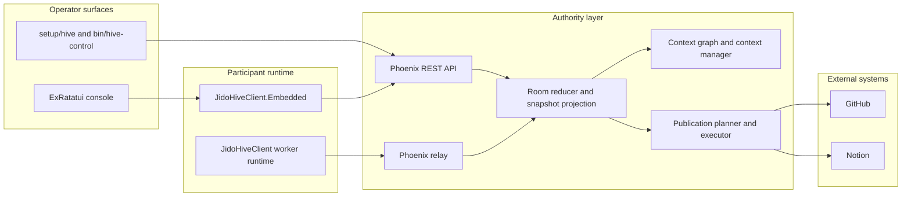

<p align="center">
  
</p>

# jido_hive

`jido_hive` is a human-plus-AI collaboration system built as an Elixir
monorepo. The core rule is simple:

- the server owns room truth
- workers and human-facing tools participate through explicit contracts
- UIs render projections of that truth instead of inventing their own state

This repository contains:

- `jido_hive_server`: authoritative room server, relay, REST API, dispatch,
  context graph, context manager, and publication flow
- `jido_hive_client`: participant runtime for long-running workers and embedded
  local tools
- `examples/jido_hive_termui_console`: the current operator console, built with
  `ExRatatui`
- the root workspace project: repo-wide developer tooling and quality gates

If you are new here, read this file first.

## Table of contents

- [Quick start](#quick-start)
- [System architecture](#system-architecture)
- [Monorepo layout](#monorepo-layout)
- [Operator flows](#operator-flows)
- [Production connector credentials](#production-connector-credentials)
- [Developer workflow](#developer-workflow)
- [Package guides](#package-guides)

## Quick start

### Local developer setup

```bash
bin/setup
```

### Local end-to-end demo

Run the server:

```bash
bin/live-demo-server
```

Run two workers in separate shells:

```bash
bin/client-worker --worker-index 1
bin/client-worker --worker-index 2
```

Use the operator helpers:

```bash
bin/hive-control
bin/hive-clients
```

### Production operator flow

```bash
bin/hive-control --prod
bin/hive-clients --prod
./examples/jido_hive_termui_console/hive console --prod --participant-id alice --debug
```

## System architecture



### Practical mental model

- `jido_hive_server` decides what exists in the room right now.
- `jido_hive_client` executes assignments or human actions against that room.
- the console is a user-facing shell around the embedded client runtime.
- publications are server-owned runs against connector-backed credentials.

## Monorepo layout

- [README.md](/home/home/p/g/n/jido_hive/README.md): root onboarding and repo-wide workflow
- [jido_hive_server/README.md](/home/home/p/g/n/jido_hive/jido_hive_server/README.md): server architecture, routes, persistence, deployment
- [jido_hive_client/README.md](/home/home/p/g/n/jido_hive/jido_hive_client/README.md): participant runtime and embedded API
- [examples/jido_hive_termui_console/README.md](/home/home/p/g/n/jido_hive/examples/jido_hive_termui_console/README.md): operator guide, keybindings, connector setup

## Operator flows

### Local

- inspect server status: `setup/hive doctor`
- inspect available workers: `setup/hive targets`
- run the bundled local flow: `setup/hive live-demo --participant-count 2`

### Production

- server info: `setup/hive --prod server-info`
- targets: `setup/hive --prod targets`
- connector connections: `setup/hive --prod connections github --subject alice`
- connector connections: `setup/hive --prod connections notion --subject alice`

### End-to-end publication sanity targets

These are the current validated publication targets:

- GitHub repo: `nshkrdotcom/test`
- Notion data source: `49970410-3e2c-49c9-bd4d-220ebb5d72f7`

## Production connector credentials

This is the part that matters most for operator success.

### Use these credential types for manual installs

- GitHub: use a PAT-backed `GITHUB_TOKEN`
- Notion: use an internal integration `NOTION_TOKEN`

### Do not treat these as the default manual-install path

These environment variables may exist in your shell, but they are not the
current recommended manual-install path unless you have revalidated them:

- `GITHUB_OAUTH_ACCESS_TOKEN`
- `NOTION_OAUTH_ACCESS_TOKEN`

Observed production behavior on 2026-04-08:

- PAT-backed `GITHUB_TOKEN`: works for issue creation
- `GITHUB_OAUTH_ACCESS_TOKEN`: connected, but failed issue creation to
  `nshkrdotcom/test`
- `NOTION_TOKEN`: works for page creation
- `NOTION_OAUTH_ACCESS_TOKEN`: provider rejected it with `401 unauthorized`

For the full operator walkthrough, including the exact site steps, environment
exports, and install commands, read:

- [examples/jido_hive_termui_console/README.md](/home/home/p/g/n/jido_hive/examples/jido_hive_termui_console/README.md)

### Fast operator setup recipe

If you only need the shortest production-safe path:

1. Create a GitHub PAT with `repo` scope. Do not use `GITHUB_OAUTH_ACCESS_TOKEN` for the default manual-install path.
2. Create a Notion internal integration and share the target data source with it. Do not use `NOTION_OAUTH_ACCESS_TOKEN` for the default manual-install path.
3. Put these in `~/.bash/bash_secrets`:
   - `export GITHUB_TOKEN="..."`
   - `export NOTION_TOKEN="..."`
   - `export JIDO_INTEGRATION_V2_GITHUB_WRITE_REPO="nshkrdotcom/test"`
4. Reload the shell with `source ~/.bash/bash_secrets`.
5. Complete the installs:
   - `setup/hive --prod start-install github --subject alice`
   - `setup/hive --prod complete-install <install-id> --subject alice --access-token "$GITHUB_TOKEN"`
   - `setup/hive --prod start-install notion --subject alice`
   - `setup/hive --prod complete-install <install-id> --subject alice --access-token "$NOTION_TOKEN"`
6. Verify:
   - `setup/hive --prod connections github --subject alice`
   - `setup/hive --prod connections notion --subject alice`
7. Run the console:
   - `./examples/jido_hive_termui_console/hive console --prod --participant-id alice --debug`

## Developer workflow

### Repo-wide quality gate

Run this from the repo root:

```bash
mix ci
```

That runs the workspace checks across all nested Mix apps:

1. `mix deps.get`
2. `mix format --check-formatted`
3. `mix compile --warnings-as-errors`
4. `mix test`
5. `mix credo --strict`
6. `mix dialyzer --force-check`
7. `mix docs --warnings-as-errors`

### Common developer loops

Compile everything:

```bash
mix mr.compile
```

Run tests everywhere:

```bash
mix mr.test
```

Run docs everywhere:

```bash
mix mr.docs
```

### Architecture discussion

When the system feels confusing, come back to these invariants:

- the server is the authority for rooms, context objects, dispatch state, and publication runs
- the client executes human and worker actions against that authority
- the console projects room state and gathers operator intent; it does not define truth
- connector auth is server-backed state; the console only reads and uses those connections

### How to navigate the codebase

If you are changing:

- room truth, policies, publications, connector install flow: start in
  `jido_hive_server`
- worker runtime, embedded API, human chat submission flow: start in
  `jido_hive_client`
- operator UX, keybindings, screen state, publish forms: start in
  `examples/jido_hive_termui_console`

## Package guides

- Server: [jido_hive_server/README.md](/home/home/p/g/n/jido_hive/jido_hive_server/README.md)
- Client: [jido_hive_client/README.md](/home/home/p/g/n/jido_hive/jido_hive_client/README.md)
- Console example: [examples/jido_hive_termui_console/README.md](/home/home/p/g/n/jido_hive/examples/jido_hive_termui_console/README.md)
