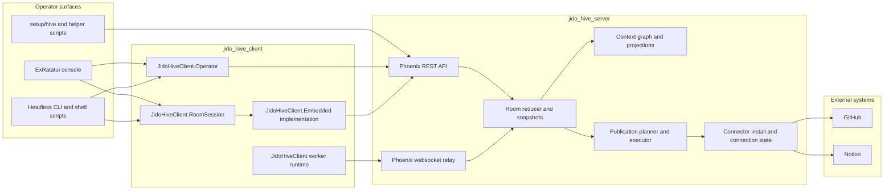

<p align="center">
  
</p>

# jido_hive

`jido_hive` is a human-plus-AI collaboration system built as an Elixir monorepo.

The governing rule is simple:

- the server owns room truth
- the client owns operator/runtime behavior against that truth
- the TUI is a consumer of the client, not a second source of workflow semantics

This repo currently contains:

- `jido_hive_server`: authoritative room engine, REST API, relay, context graph, dispatch, publications, connector state
- `jido_hive_client`: worker runtime, headless operator API, room session boundary, and scriptable CLI
- `examples/jido_hive_termui_console`: the ExRatatui operator console built on top of `jido_hive_client`
- the root workspace project: shared quality gates and monorepo tooling

If you are new here, read this file first, then the package READMEs.

## Table of contents

- [Quick start](#quick-start)
- [Architecture at a glance](#architecture-at-a-glance)
- [Monorepo layout](#monorepo-layout)
- [Operator surfaces](#operator-surfaces)
- [Production connector setup](#production-connector-setup)
- [Developer workflow](#developer-workflow)
- [Debugging order](#debugging-order)
- [Package guides](#package-guides)

## Quick start

### Local setup

```bash
bin/setup
```

### Local runtime

Run the server:

```bash
bin/live-demo-server
```

Run at least two workers in separate shells:

```bash
bin/client-worker --worker-index 1
bin/client-worker --worker-index 2
```

Use the helper scripts:

```bash
bin/hive-control
bin/hive-clients
```

### Local operator console

```bash
cd examples/jido_hive_termui_console
mix deps.get
mix escript.build
./hive console --local --participant-id alice --debug
```

### Headless operator CLI

```bash
cd jido_hive_client
mix escript.build
./jido_hive_client room list --api-base-url http://127.0.0.1:4000/api
./jido_hive_client room show --api-base-url http://127.0.0.1:4000/api --room-id <room-id>
./jido_hive_client room submit --api-base-url http://127.0.0.1:4000/api --room-id <room-id> --participant-id alice --text "hello"
```

### Production operator console

```bash
bin/hive-control --prod
bin/hive-clients --prod
cd examples/jido_hive_termui_console
mix escript.build
./hive console --prod --participant-id alice --debug
```

## Architecture at a glance



### Practical model

- `jido_hive_server` decides what the room is.
- `jido_hive_client` is the reusable operator/runtime platform for talking to that room.
- the console is a rendering shell plus input adapter over the client.
- if a behavior cannot be reproduced from the headless client surface, the seam is still wrong.

## Monorepo layout

- [README.md](README.md): root onboarding and repo-wide workflow
- [jido_hive_server/README.md](jido_hive_server/README.md): authoritative server design, routes, publications, deployment
- [jido_hive_client/README.md](jido_hive_client/README.md): operator API, room session boundary, worker runtime, headless CLI
- [examples/jido_hive_termui_console/README.md](examples/jido_hive_termui_console/README.md): operator guide, keybindings, troubleshooting, connector walkthrough

## Operator surfaces

### `setup/hive`

Use this for server-oriented inspection and operational helpers:

```bash
setup/hive doctor
setup/hive targets
setup/hive server-info
setup/hive --prod doctor
setup/hive --prod targets
setup/hive --prod server-info
```

### `jido_hive_client` headless CLI

Use this when you want to separate TUI bugs from client/server bugs.

Build once:

```bash
cd jido_hive_client
mix escript.build
```

Representative commands:

```bash
./jido_hive_client room list --api-base-url https://jido-hive-server-test.app.nsai.online/api
./jido_hive_client room show --api-base-url https://jido-hive-server-test.app.nsai.online/api --room-id <room-id>
./jido_hive_client room tail --api-base-url https://jido-hive-server-test.app.nsai.online/api --room-id <room-id>
./jido_hive_client room submit --api-base-url https://jido-hive-server-test.app.nsai.online/api --room-id <room-id> --participant-id alice --text "hello"
./jido_hive_client room accept --api-base-url https://jido-hive-server-test.app.nsai.online/api --room-id <room-id> --participant-id alice --context-id <context-id>
./jido_hive_client room resolve --api-base-url https://jido-hive-server-test.app.nsai.online/api --room-id <room-id> --participant-id alice --left <ctx-a> --right <ctx-b> --text "resolution"
./jido_hive_client auth state --api-base-url https://jido-hive-server-test.app.nsai.online/api --subject alice
```

Structured trace stays on stderr:

```bash
JIDO_HIVE_CLIENT_LOG_LEVEL=debug \
./jido_hive_client room show --api-base-url https://jido-hive-server-test.app.nsai.online/api --room-id <room-id> \
  > room.json \
  2> trace.ndjson
```

All mutating commands return an explicit `operation_id` in their JSON output.

### ExRatatui console

Use the console when you want the full operator UX.

```bash
cd examples/jido_hive_termui_console
mix escript.build
./hive console --prod --participant-id alice --debug
```

Recommended debug tail:

```bash
tail -f ~/.config/hive/termui_console.log
```

## Production connector setup

This is the current validated manual-install path.

### Use these exact token types

- GitHub manual installs: `GITHUB_TOKEN`
- Notion manual installs: `NOTION_TOKEN`

### Do not use these as the default manual-install path

These may exist in your environment, but they are not the currently validated default path:

- `GITHUB_OAUTH_ACCESS_TOKEN`
- `NOTION_OAUTH_ACCESS_TOKEN`

Observed working behavior on 2026-04-08:

- `GITHUB_TOKEN` PAT: works for GitHub issue publication
- `GITHUB_OAUTH_ACCESS_TOKEN`: connected previously, but failed GitHub issue creation
- `NOTION_TOKEN`: works for Notion page publication
- `NOTION_OAUTH_ACCESS_TOKEN`: rejected by the provider with `401 unauthorized`

### Current validated publication targets

- GitHub repo: `nshkrdotcom/test`
- Notion data source: `49970410-3e2c-49c9-bd4d-220ebb5d72f7`

### Fast production-safe setup

1. Create a GitHub PAT with `repo` scope.
2. Create a Notion internal integration and share the target data source with it.
3. Put these in `~/.bash/bash_secrets`:
   - `export GITHUB_TOKEN="..."`
   - `export NOTION_TOKEN="..."`
   - `export JIDO_INTEGRATION_V2_GITHUB_WRITE_REPO="nshkrdotcom/test"`
4. Reload the shell:
   - `source ~/.bash/bash_secrets`
5. Complete the server-backed installs:
   - `setup/hive --prod start-install github --subject alice`
   - `setup/hive --prod complete-install <install-id> --subject alice --access-token "$GITHUB_TOKEN"`
   - `setup/hive --prod start-install notion --subject alice`
   - `setup/hive --prod complete-install <install-id> --subject alice --access-token "$NOTION_TOKEN"`
6. Verify:
   - `setup/hive --prod connections github --subject alice`
   - `setup/hive --prod connections notion --subject alice`
7. Open the console publish screen and confirm both channels show `auth:connected`.

For the full site-by-site walkthrough, use the console guide:

- [examples/jido_hive_termui_console/README.md](examples/jido_hive_termui_console/README.md)

## Developer workflow

### Repo-wide quality gate

From the repo root:

```bash
mix ci
```

That runs:

1. `mix deps.get`
2. `mix format --check-formatted`
3. `mix compile --warnings-as-errors`
4. `mix test`
5. `mix credo --strict`
6. `mix dialyzer --force-check`
7. `mix docs --warnings-as-errors`

### Useful shortcuts

```bash
mix mr.compile
mix mr.test
mix mr.credo
mix mr.dialyzer
mix mr.docs
```

### Working rule

When you are debugging behavior:

- reproduce it through `jido_hive_client` headless CLI first
- if it reproduces there, it is not a TUI bug
- if it only reproduces in the console, the bug is in the ExRatatui app layer

## Debugging order

Use this order whenever the system feels confusing.

1. Confirm server truth:
   - `setup/hive ...`
   - direct room/auth endpoints
2. Reproduce with `jido_hive_client` headless CLI.
3. Only after that, inspect the ExRatatui console.
4. If a room action is only testable through the TUI, add a headless path before doing more UI work.
5. Use local `iex` for server/client internals when needed; production remote attach is not yet a supported repo workflow.

Detailed runbook:

- `~/jb/docs/20260408/jido_hive_debugging_introspection/jido_hive_debugging_introspection_and_runbook.md`

## Package guides

- Server: [jido_hive_server/README.md](jido_hive_server/README.md)
- Client: [jido_hive_client/README.md](jido_hive_client/README.md)
- Console: [examples/jido_hive_termui_console/README.md](examples/jido_hive_termui_console/README.md)
