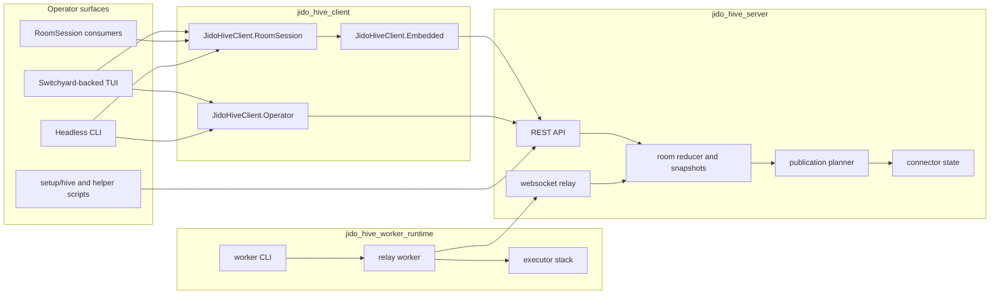

<p align="center">
  
</p>

# jido_hive

`jido_hive` is a human-plus-AI collaboration system built as a non-umbrella
Elixir monorepo.

The governing rule is simple:

- `jido_hive_server` owns room truth
- `jido_hive_client` owns reusable operator and room-session behavior
- `jido_hive_worker_runtime` owns relay workers and local assignment execution
- Switchyard packages and the example console consume those seams; they do not
  redefine them

If a room behavior cannot be reproduced from the headless client surface, the
seam is still wrong.

## Repo layout

This repo currently contains:

- `jido_hive_server`
  authoritative room engine, REST API, websocket relay, context graph,
  publications, connector state
- `jido_hive_client`
  headless operator API, JSON CLI, and room-scoped local session boundary
- `jido_hive_worker_runtime`
  long-lived relay worker runtime, local executor stack, worker CLI, and worker
  control API
- `jido_hive_switchyard_site`
  Jido Hive resource/action mapping over generic Switchyard contracts
- `jido_hive_switchyard_tui`
  Jido Hive operator workflow mounted on the generic Switchyard host
- `examples/jido_hive_console`
  runnable composition layer and smoke helper over the Switchyard-backed Jido
  Hive TUI
- the root workspace project
  shared quality gates and monorepo tooling

Start with this file, then the package READMEs.

## Quick start

### Setup

```bash
bin/setup
```

### Local runtime

Start the server:

```bash
bin/live-demo-server
```

Start at least two workers in separate shells:

```bash
bin/client-worker --worker-index 1
bin/client-worker --worker-index 2
```

Or use the helper menus:

```bash
bin/hive-control
bin/hive-clients
```

### Local operator console

```bash
cd examples/jido_hive_console
mix deps.get
mix escript.build
./hive console --local --participant-id alice --debug
```

### Headless operator CLI

```bash
cd jido_hive_client
mix deps.get
mix escript.build

./jido_hive_client room list --api-base-url http://127.0.0.1:4000/api
./jido_hive_client room show --api-base-url http://127.0.0.1:4000/api --room-id <room-id>
./jido_hive_client room workflow --api-base-url http://127.0.0.1:4000/api --room-id <room-id>
./jido_hive_client room focus --api-base-url http://127.0.0.1:4000/api --room-id <room-id>
./jido_hive_client room inspect --api-base-url http://127.0.0.1:4000/api --room-id <room-id>
./jido_hive_client room provenance --api-base-url http://127.0.0.1:4000/api --room-id <room-id> --context-id <context-id>
./jido_hive_client room submit --api-base-url http://127.0.0.1:4000/api --room-id <room-id> --participant-id alice --text "hello"
```

### Production shortcuts

```bash
bin/hive-control --prod
bin/hive-clients --prod
```

## Architecture at a glance



### Practical model

- the server decides what the room is
- the client reads and mutates that truth through reusable operator/session seams
- the worker runtime executes assignments and publishes structured results
- the Switchyard-backed TUI renders those seams interactively
- the example console is only a runnable composition layer

### Product model

What is unique here is not the transcript or the websocket transport. It is the
combination of:

- server-owned workflow truth
- a typed shared context graph with provenance, contradiction, and canonical
  signals
- the same room model exposed through API, headless CLI, and TUI
- publication planning that explains what becomes official output and why

## Package guide

- [jido_hive_server/README.md](jido_hive_server/README.md)
  server truth, routes, publications, deployment
- [jido_hive_client/README.md](jido_hive_client/README.md)
  operator API, room session boundary, headless CLI
- [jido_hive_worker_runtime/README.md](jido_hive_worker_runtime/README.md)
  relay workers, executor stack, worker CLI
- [jido_hive_switchyard_site/README.md](jido_hive_switchyard_site/README.md)
  Jido Hive site adapter for Switchyard
- [jido_hive_switchyard_tui/README.md](jido_hive_switchyard_tui/README.md)
  Jido Hive operator workflow mounted on Switchyard
- [examples/jido_hive_console/README.md](examples/jido_hive_console/README.md)
  runnable console composition layer

## Developer workflow

Run repo-wide quality gates from the repo root:

```bash
mix ci
```

Useful workspace shortcuts:

```bash
mix mr.deps.get
mix mr.format
mix mr.compile
mix mr.test
mix mr.credo
mix mr.dialyzer
mix mr.docs
```

## Debugging order

Always debug in this order:

1. server truth
2. headless `jido_hive_client`
3. worker runtime only if the bug is assignment delivery or local execution
4. Switchyard-backed TUI
5. example composition layer

Representative first checks:

```bash
setup/hive server-info
curl -sS http://127.0.0.1:4000/api/rooms/<room-id> | jq
curl -sS http://127.0.0.1:4000/api/rooms/<room-id>/timeline | jq
```

Then reproduce headlessly:

```bash
cd jido_hive_client
mix escript.build

./jido_hive_client room show --api-base-url http://127.0.0.1:4000/api --room-id <room-id>
./jido_hive_client room tail --api-base-url http://127.0.0.1:4000/api --room-id <room-id>
./jido_hive_client room submit --api-base-url http://127.0.0.1:4000/api --room-id <room-id> --participant-id alice --text "debug probe"
```

Only after that should you open the TUI:

```bash
cd examples/jido_hive_console
mix escript.build
./hive console --local --participant-id alice --debug --room-id <room-id>
```

For the detailed triage sequence, read
[docs/debugging_guide.md](docs/debugging_guide.md).

## Other guides

- [docs/architecture.md](docs/architecture.md)
- [docs/debugging_guide.md](docs/debugging_guide.md)
- [setup/README.md](setup/README.md)
- [docs/developer/multi_agent_round_robin.md](docs/developer/multi_agent_round_robin.md)

## License

[MIT](LICENSE)
