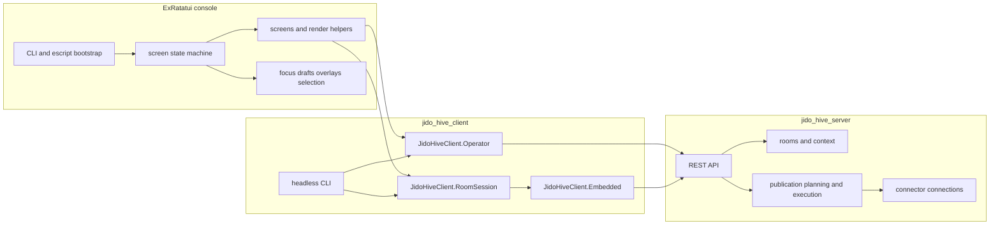

# Jido Hive Terminal Console

`examples/jido_hive_console` is the interactive operator console for
`jido_hive`.

It is intentionally not the source of room behavior.

The current contract is:

- `jido_hive_server` owns room truth
- `jido_hive_client` owns operator workflows and room-session behavior
- this console owns only terminal UX, routing, focus, draft buffers, and visual state

If a bug cannot be reproduced without the TUI, debug the TUI.
If it can be reproduced headlessly, debug the client or server first.

## Table of contents

- [What this console is](#what-this-console-is)
- [Quick start](#quick-start)
- [Keybindings and operator UX](#keybindings-and-operator-ux)
- [Debugging order](#debugging-order)
- [Production connector setup](#production-connector-setup)
- [Manual connector install walkthrough](#manual-connector-install-walkthrough)
- [Headless equivalents for every core action](#headless-equivalents-for-every-core-action)
- [Troubleshooting](#troubleshooting)
- [Developer guide](#developer-guide)
- [Related docs](#related-docs)

## What this console is

The console lets an operator:

- browse saved rooms from the lobby
- create new rooms from the wizard
- inspect room context, events, and publication readiness
- submit human chat into a room as tracked operations
- inspect provenance and accept selected context
- publish room output to GitHub and Notion through server-backed connections

What it does not do:

- define canonical room state
- own connector truth
- hide client transport semantics inside view code
- remain the only executable path for operator actions

## Quick start

### Local

From this directory:

```bash
mix deps.get
mix escript.build
./hive console --local --participant-id alice --debug
```

In other shells, run the local demo server and workers from the repo root:

```bash
bin/live-demo-server
bin/client-worker --worker-index 1
bin/client-worker --worker-index 2
```

Fast non-TUI smoke path from the repo root:

```bash
bin/hive-room-smoke \
  --brief "local smoke room" \
  --text "hello from the scripted path" \
  --text "second message"
```

### Production

```bash
mix escript.build
./hive console --prod --participant-id alice --debug
```

Recommended debug tail:

```bash
tail -f ~/.config/hive/hive_console.log
```

The preferred room workflow is now:

1. create/open room
2. start room run
3. keep using the room while run state is tracked separately
4. submit human chat and watch the operation id in the status/debug surface

Current console implementation notes:

- the console does not poll room-run status directly anymore
- room-family screens consume `room_session_snapshot` updates from `JidoHiveClient.RoomSession`
- submit/run status is derived from `JidoHiveClient.RoomFlow`
- the underlying room session polls the consolidated `/rooms/:id/sync` endpoint

### First production validation

Use this order if you are onboarding from zero:

1. Verify server reachability:
   - `setup/hive --prod server-info`
2. Verify available worker targets:
   - `setup/hive --prod targets`
3. Verify connector connections:
   - `setup/hive --prod connections github --subject alice`
   - `setup/hive --prod connections notion --subject alice`
4. Start the console:
   - `./hive console --prod --participant-id alice --debug`
5. Open or create a room.
6. Submit one human chat message.
7. Open publish and confirm both channels show `auth:connected`.

## Keybindings and operator UX

### Global

- `Ctrl+Q`: quit the console
- `Ctrl+C`: emergency quit path
- `Ctrl+G` or `F1`: open the current screen guide
- `F2`: open the debug popup
- `Enter` or `Esc` on guide dialogs: close the guide

### Lobby

- `Up` / `Down`: move selection
- `Enter`: open selected room
- `n`: open the new-room wizard
- `r`: refresh room summaries
- `d`: remove a stale saved-room entry

### Room

- type directly into the draft box
- `Enter`: submit chat or open a selected conflict
- `Ctrl+E`: open provenance / evidence details
- `Ctrl+A`: accept the selected context object
- `Ctrl+P`: open publish
- `Ctrl+B`: back to lobby

Room submit and room run are now operation-based:

- the status line includes an operation id while a submit is pending
- `F2` shows the latest room operation and transport lane diagnostics
- room run start is accepted and tracked separately from room sync
- room run logging includes both `client_operation_id` and `server_operation_id`
- use the `server_operation_id` for `run-status` and `/run_operations/:operation_id` checks

### Wizard and publish

- `Enter`: confirm the active step or submit the current screen when enabled
- `Esc`: back out of the current dialog or step
- guide overlays explain each screen and can be reopened with `Ctrl+G` or `F1`

## Debugging order

Use this order every time. It is how you separate UI bugs from client bugs.

1. Confirm server truth first.
   - `setup/hive --prod server-info`
   - `setup/hive --prod connections github --subject alice`
   - `curl -sS https://jido-hive-server-test.app.nsai.online/api/rooms/<room-id>`
2. Reproduce through the headless client surface.
   - `bin/hive-room-smoke --brief "debug smoke room" --text "hello" --text "second message"`
   - `cd ../../jido_hive_client`
   - `./jido_hive_client room show --api-base-url https://jido-hive-server-test.app.nsai.online/api --room-id <room-id>`
   - `./jido_hive_client room tail --api-base-url https://jido-hive-server-test.app.nsai.online/api --room-id <room-id>`
   - `./jido_hive_client room submit --api-base-url https://jido-hive-server-test.app.nsai.online/api --room-id <room-id> --participant-id alice --text "hello"`
   - `JIDO_HIVE_CLIENT_LOG_LEVEL=debug ./jido_hive_client room show --api-base-url https://jido-hive-server-test.app.nsai.online/api --room-id <room-id> > room.json 2> trace.ndjson`
3. Only if it works headlessly and fails here should you debug the ExRatatui app.
4. If a console action has no headless equivalent, add the headless path before doing more UI work.
5. Use local `iex` for server/client internals; do not assume a production remote-shell workflow exists yet.

For workflow-level regression outside the TUI, prefer the shared client harness over ad hoc console debugging:

- `JidoHiveClient.Scenario.RoomWorkflow`
- `bin/hive-room-smoke`

When debugging a console submit/run problem, collect these together:

- `~/.config/hive/hive_console.log`
- the `F2` debug popup contents
- headless stderr trace with `JIDO_HIVE_CLIENT_LOG_LEVEL=debug`
- server logs

The logs should now expose:

- `lane`
- `operation_id`
- exact request path
- timeout/completion boundary

General reproducible workflow:

- `docs/debugging_guide.md`

For the scripted non-TUI smoke helper, use:

```bash
bin/hive-room-smoke --help
```

## Production connector setup

This is the current validated manual-install path.

### Use these exact token types

- GitHub manual installs: `GITHUB_TOKEN`
- Notion manual installs: `NOTION_TOKEN`

### Do not use these as the default manual-install tokens

These may exist in your environment, but they are not the current recommended
manual-install path unless revalidated:

- `GITHUB_OAUTH_ACCESS_TOKEN`
- `NOTION_OAUTH_ACCESS_TOKEN`

Observed live behavior on 2026-04-08:

- `GITHUB_TOKEN` PAT: works
- `GITHUB_OAUTH_ACCESS_TOKEN`: connected previously, but failed GitHub issue creation
- `NOTION_TOKEN`: works
- `NOTION_OAUTH_ACCESS_TOKEN`: rejected by the provider with `401 unauthorized`

### Step 1: GitHub site setup

Use a PAT, not the OAuth token, for manual installs.

1. Sign in to GitHub.
2. Create or open the repo `nshkrdotcom/test`.
3. Ensure Issues are enabled for that repo.
4. Open `Settings -> Developer settings -> Personal access tokens -> Tokens (classic)`.
5. Generate a classic PAT.
6. Give it a clear name such as `jido-hive-dev`.
7. Grant the `repo` scope.
8. Copy the token immediately and store it securely.

### Step 2: Notion site setup

Use an internal integration token, not the OAuth access token, for manual installs.

1. Sign in to Notion.
2. Open `Settings & members`.
3. Open the integrations area.
4. Create a new internal integration.
5. Give it a clear name such as `Jido Hive Dev`.
6. Copy the internal integration token.
7. Open the destination data source.
8. Share that data source with the integration.
9. Confirm the destination is a real data source/database, not only a page.
10. Record the data source id.
11. The currently validated example value is `49970410-3e2c-49c9-bd4d-220ebb5d72f7`.
12. The currently validated title property is `Name`.

### Step 3: put the working tokens in `~/.bash/bash_secrets`

Recommended exports:

```bash
export GITHUB_TOKEN="<your GitHub PAT with repo scope>"
export NOTION_TOKEN="<your Notion internal integration token>"
export JIDO_INTEGRATION_V2_GITHUB_WRITE_REPO="nshkrdotcom/test"
export NOTION_EXAMPLE_DATA_SOURCE_ID="49970410-3e2c-49c9-bd4d-220ebb5d72f7"
```

Reload the shell:

```bash
source ~/.bash/bash_secrets
```

## Manual connector install walkthrough

These steps create the server-backed connections the publish screen actually uses.

### GitHub manual install

Start install:

```bash
setup/hive --prod start-install github --subject alice
```

Take the returned `install_id`, then complete it with the PAT:

```bash
setup/hive --prod complete-install <install-id> --subject alice --access-token "$GITHUB_TOKEN"
```

Verify:

```bash
setup/hive --prod connections github --subject alice
```

Expected shape:

- `state: connected`
- `requested_scopes: ["repo"]`
- `granted_scopes: ["repo"]`

### Notion manual install

Start install:

```bash
setup/hive --prod start-install notion --subject alice
```

Complete it with the internal integration token:

```bash
setup/hive --prod complete-install <install-id> --subject alice --access-token "$NOTION_TOKEN"
```

Verify:

```bash
setup/hive --prod connections notion --subject alice
```

Expected shape:

- `state: connected`
- `requested_scopes` includes `notion.content.insert`
- `granted_scopes` includes `notion.content.insert`

### Console-side auth check

Once those server connections exist, run the console and open publish.

Expected publish screen state:

- `github auth:connected`
- `notion auth:connected`

## Headless equivalents for every core action

These are the first tools to use when a console behavior feels wrong.

Build the headless client once:

```bash
cd ../../jido_hive_client
mix escript.build
```

### List rooms

```bash
./jido_hive_client room list --api-base-url https://jido-hive-server-test.app.nsai.online/api
```

### Show room snapshot

```bash
./jido_hive_client room show --api-base-url https://jido-hive-server-test.app.nsai.online/api --room-id <room-id>
```

### Tail room timeline

```bash
./jido_hive_client room tail --api-base-url https://jido-hive-server-test.app.nsai.online/api --room-id <room-id>
```

### Submit human chat

```bash
./jido_hive_client room submit --api-base-url https://jido-hive-server-test.app.nsai.online/api --room-id <room-id> --participant-id alice --text "hello"
```

### Accept context

```bash
./jido_hive_client room accept --api-base-url https://jido-hive-server-test.app.nsai.online/api --room-id <room-id> --participant-id alice --context-id <context-id>
```

### Resolve a contradiction

```bash
./jido_hive_client room resolve --api-base-url https://jido-hive-server-test.app.nsai.online/api --room-id <room-id> --participant-id alice --left <ctx-a> --right <ctx-b> --text "resolution"
```

### Publish headlessly

```bash
./jido_hive_client room publish --api-base-url https://jido-hive-server-test.app.nsai.online/api --room-id <room-id> --payload-file publish.json
```

### Inspect auth state

```bash
./jido_hive_client auth state --api-base-url https://jido-hive-server-test.app.nsai.online/api --subject alice
```

## Troubleshooting

### Publish says auth is missing

First verify the server connection records directly:

```bash
setup/hive --prod connections github --subject alice
setup/hive --prod connections notion --subject alice
```

If those are missing, the publish screen is correct.

### GitHub is connected but publish still fails

Most likely cause: the install was completed with `GITHUB_OAUTH_ACCESS_TOKEN` instead of the PAT-backed `GITHUB_TOKEN`.

Fix:

1. Start a fresh GitHub install.
2. Complete it with `GITHUB_TOKEN`.
3. Verify the target repo is `nshkrdotcom/test`.
4. Verify the token owner can create issues in that repo.

### Notion is connected but publish still fails

Most likely cause: the install was completed with `NOTION_OAUTH_ACCESS_TOKEN` instead of `NOTION_TOKEN`.

Fix:

1. Start a fresh Notion install.
2. Complete it with `NOTION_TOKEN`.
3. Confirm the target data source is shared with the integration.
4. Confirm the data source id and title property are correct.

### The console ignores fresh source changes

Rebuild the escript:

```bash
mix escript.build
```

### My terminal is broken after a crash

Run:

```bash
reset
```

### A room looks empty in the TUI, but should not be

Check server truth and the headless client before changing UI code:

```bash
curl -sS https://jido-hive-server-test.app.nsai.online/api/rooms/<room-id>
cd ../../jido_hive_client
./jido_hive_client room show --api-base-url https://jido-hive-server-test.app.nsai.online/api --room-id <room-id>
./jido_hive_client room tail --api-base-url https://jido-hive-server-test.app.nsai.online/api --room-id <room-id>
```

If those surfaces have the data and the console does not, the bug is in the console.

For a clean trace while reproducing:

```bash
JIDO_HIVE_CLIENT_LOG_LEVEL=debug \
./jido_hive_client room show --api-base-url https://jido-hive-server-test.app.nsai.online/api --room-id <room-id> \
  > room.json \
  2> trace.ndjson
```

### Chat submission says it is still in progress

Current design:

- the submit path runs through `JidoHiveClient.RoomSession`
- the client acknowledges server success before any slower local refresh completes
- the room session drives timeline polling and only refetches room/context when
  new timeline entries arrive or a full refresh is requested

Debug it in this order:

1. tail the console log:
   - `tail -f ~/.config/hive/hive_console.log`
2. verify server truth with `curl` or `jido_hive_client room show`
3. if headless submit succeeds and the console wedges, debug the TUI layer
4. if headless submit also wedges, debug `jido_hive_client`

## Developer guide

### Architecture



### What state is local to the console

The console should own only view and input state.

Current local state includes:

- current route and screen
- focus and selection
- draft buffers
- wizard and publish form fields
- help and debug overlay visibility
- transient banners and status copy

The console should not own:

- authoritative room truth
- transport semantics
- connector truth
- sync recovery policy that belongs in the client session
- business logic that must also work headlessly

### Runtime architecture

The console now runs on `use ExRatatui.App, runtime: :reducer`.

That means:

- all terminal input and mailbox messages flow through one reducer path in `App.update/2`
- one-shot side effects are returned as `ExRatatui.Command` values
- repeating timers are declared in `subscriptions/1`, not ad hoc `Process.send_after` calls
- `F2` can render `ExRatatui.Runtime` inspection data such as active subscriptions, async command count, and recent trace events

This is the key seam:

- `app.ex` owns reducer transitions and command/subscription wiring
- `nav.ex` owns navigation and session attachment
- `model.ex` owns console-local state only
- `screen_ui.ex` renders shared overlays from state, including runtime debug data
- `jido_hive_client` still owns room session behavior and headless operator workflows

### Code map

High-value files:

- `lib/jido_hive_console/app.ex`: reducer entrypoint, command wiring, and subscriptions
- `lib/jido_hive_console/nav.ex`: navigation and route helpers
- `lib/jido_hive_console/model.ex`: console-local view/input state
- `lib/jido_hive_console/screen_ui.ex`: shared overlays and render helpers
- `lib/jido_hive_console/screens/room.ex`: room screen rendering, including event projection from the room session snapshot
- `lib/jido_hive_console/screens/`: lobby, room, wizard, publish, conflict, and other screens

### Local dependency note

During active runtime work, this app currently points at the sibling checkout:

- `mix.exs` uses `{:ex_ratatui, path: "../../../ex_ratatui"}`

That keeps console and library work synchronized while the reducer/runtime API is being hardened.

### Design rules

- do not add console-local HTTP/auth/config helpers back into this app
- call `JidoHiveClient.Operator` for headless operator workflows
- call `JidoHiveClient.RoomSession` for room-scoped human participation flows
- if a room action cannot be reproduced headlessly, the seam is still wrong
- keep render code dumb and reducer transitions explicit
- keep timer-driven behavior in `subscriptions/1`
- keep async work in `ExRatatui.Command.async/2`, not inline process plumbing
- use local `iex` for server/client modules first; the TUI is a worse live-REPL target than the headless client

### Quality loop

From this directory:

```bash
mix test
mix credo --strict
mix dialyzer --force-check
mix docs --warnings-as-errors
mix escript.build
```

Or from the repo root:

```bash
mix ci
```

## Related docs

- Root guide: [README.md](../../README.md)
- General debugging guide: `docs/debugging_guide.md`
- Client guide: [jido_hive_client/README.md](../../jido_hive_client/README.md)
- Server guide: [jido_hive_server/README.md](../../jido_hive_server/README.md)
- Debugging runbook: `~/jb/docs/20260408/jido_hive_debugging_introspection/jido_hive_debugging_introspection_and_runbook.md`
- Refactor plan path: `~/jb/docs/20260408/jido_hive_refactor_debuggability/jido_hive_architecture_refactor_debuggability_plan_v3.md`
- Execution checklist path: `~/jb/docs/20260408/jido_hive_refactor_debuggability/jido_hive_architecture_refactor_execution_checklist.md`
