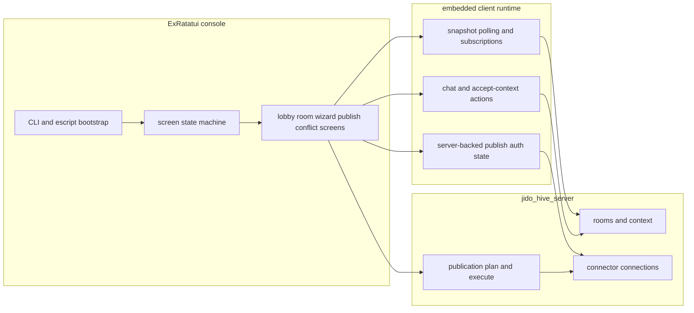

# Jido Hive Terminal Console

This example is the current operator console for `jido_hive`.

It is built on:

- `ExRatatui` for the terminal UI shell
- the embedded client runtime for local human participation
- `jido_hive_server` for authoritative room truth, publications, and connector auth

If you want the fastest path from zero to a working console session, start here.

## Table of contents

- [What this console does](#what-this-console-does)
- [Quick start](#quick-start)
- [Keybindings and UX](#keybindings-and-ux)
- [Production credential setup](#production-credential-setup)
- [Manual connector install walkthrough](#manual-connector-install-walkthrough)
- [Troubleshooting](#troubleshooting)
- [Developer guide](#developer-guide)

## What this console does

The console lets an operator:

- browse saved rooms from the lobby
- create new rooms with the wizard
- inspect room context, events, and publications
- submit human chat into the room
- accept or inspect context objects
- publish to GitHub and Notion using server-backed connector connections

## Quick start

### Local

From the example directory:

```bash
mix deps.get
mix escript.build
./hive console --local --participant-id alice --debug
```

### Production

```bash
mix escript.build
./hive console --prod --participant-id alice --debug
```

Recommended debug log tail:

```bash
tail -f ~/.config/hive/termui_console.log
```

### Recommended first production validation

Use this exact order if you are onboarding from zero:

1. verify server reachability with `setup/hive --prod server-info`
2. verify worker targets with `setup/hive --prod targets`
3. verify connector connections with:
   - `setup/hive --prod connections github --subject alice`
   - `setup/hive --prod connections notion --subject alice`
4. start the console with `./hive console --prod --participant-id alice --debug`
5. open an existing room or create one from the wizard
6. submit one human chat message
7. open publish and confirm both connectors show `auth:connected`

## Keybindings and UX

### Global

- `Ctrl+Q`: quit the console
- `Ctrl+C`: emergency quit path
- `Ctrl+G` or `F1`: open the current screen guide
- `Ctrl+D` or `F2`: open the debug popup
- `Enter` or `Esc` on guide dialogs: close the guide

### Lobby

- `Up` / `Down`: move selection
- `Enter`: open selected room
- `n`: new room wizard
- `r`: refresh room summaries
- `d`: remove stale local room entry

### Room

- type directly into the draft box
- `Enter`: submit chat or open conflict when a conflict is selected
- `Ctrl+E`: provenance / evidence inspection
- `Ctrl+A`: accept selected context
- `Ctrl+P`: open publish screen
- `Ctrl+B`: back to lobby

## Production credential setup

This is the most important section in this file.

### Use these exact credential types for manual installs

- GitHub manual installs: use `GITHUB_TOKEN`
- Notion manual installs: use `NOTION_TOKEN`

### Do not use these as the default manual-install tokens

These may exist in your environment, but they are not the current recommended
manual-install path unless you have revalidated them yourself:

- `GITHUB_OAUTH_ACCESS_TOKEN`
- `NOTION_OAUTH_ACCESS_TOKEN`

Observed live behavior on 2026-04-08:

- `GITHUB_TOKEN` PAT: works
- `GITHUB_OAUTH_ACCESS_TOKEN`: connected, but failed GitHub issue creation
- `NOTION_TOKEN`: works
- `NOTION_OAUTH_ACCESS_TOKEN`: provider rejected it with `401 unauthorized`

### Step 1: GitHub site setup

Use a PAT, not the OAuth token, for manual installs.

#### Create the repo used for validation

1. Sign in to GitHub.
2. Create or open the repo `nshkrdotcom/test`.
3. Ensure the repo is `private` or `public` as desired, but make sure Issues are enabled.
4. Ensure the account creating the token can open issues in that repo.

#### Create the token

Simplest working path:

1. Go to `GitHub -> Settings -> Developer settings -> Personal access tokens -> Tokens (classic)`.
2. Click `Generate new token (classic)`.
3. Give it a name like `jido-hive-dev`.
4. Choose an expiration that fits your dev workflow.
5. Enable the `repo` scope.
6. Generate the token.
7. Copy it immediately. GitHub will not show it again.

### Step 2: Notion site setup

Use an internal integration token, not the OAuth access token, for manual installs.

#### Create the integration

1. Sign in to Notion.
2. Open `Settings & members`.
3. Open the integrations area. The exact label may vary, but it is the place where you create or manage internal integrations.
4. Create a new internal integration.
5. Give it a clear name like `Jido Hive Dev`.
6. Copy the internal integration token.

#### Prepare the target database / data source

1. Open the database or data source that should receive published pages.
2. Share or connect that database with the integration you just created.
3. Confirm the target is a real database / data source, not just a plain page.
4. Record the data source id.
5. For the current validated environment, the working example value is:
   - `49970410-3e2c-49c9-bd4d-220ebb5d72f7`
6. The title property should be:
   - `Name`

### Step 3: put the working tokens in `~/.bash/bash_secrets`

Recommended exports:

```bash
export GITHUB_TOKEN="<your GitHub PAT with repo scope>"
export NOTION_TOKEN="<your Notion internal integration token>"
export JIDO_INTEGRATION_V2_GITHUB_WRITE_REPO="nshkrdotcom/test"
export NOTION_EXAMPLE_DATA_SOURCE_ID="49970410-3e2c-49c9-bd4d-220ebb5d72f7"
```

Then reload your shell:

```bash
source ~/.bash/bash_secrets
```

## Manual connector install walkthrough

These steps create the server-backed connections the publish screen actually uses.

### GitHub manual install

Start install:

```bash
setup/hive --prod start-install github --subject alice
```

Take the returned `install_id`, then complete it with the PAT:

```bash
setup/hive --prod complete-install <install-id> --subject alice --access-token "$GITHUB_TOKEN"
```

Verify:

```bash
setup/hive --prod connections github --subject alice
```

Expected shape:

- `state: connected`
- `requested_scopes: ["repo"]`
- `granted_scopes: ["repo"]`

### Notion manual install

Start install:

```bash
setup/hive --prod start-install notion --subject alice
```

Complete it with the internal integration token:

```bash
setup/hive --prod complete-install <install-id> --subject alice --access-token "$NOTION_TOKEN"
```

Verify:

```bash
setup/hive --prod connections notion --subject alice
```

Expected shape:

- `state: connected`
- `requested_scopes` includes `notion.content.insert`
- `granted_scopes` includes `notion.content.insert`

### Console-side auth check

Once those server connections exist, run the console and open publish.

Expected publish screen state:

- `github auth:connected`
- `notion auth:connected`

## Troubleshooting

### Publish says auth is missing

First, verify the server connection records directly:

```bash
setup/hive --prod connections github --subject alice
setup/hive --prod connections notion --subject alice
```

If those are missing, the publish screen is correct.

### GitHub is connected but publish still fails

Most likely cause: you completed the install with `GITHUB_OAUTH_ACCESS_TOKEN` instead of the PAT-backed `GITHUB_TOKEN`.

Fix:

1. create a fresh GitHub install
2. complete it with `GITHUB_TOKEN`
3. verify the target repo is `nshkrdotcom/test`
4. verify the account behind the token can create issues in that repo

### Notion is connected but publish still fails

Most likely cause: you completed the install with `NOTION_OAUTH_ACCESS_TOKEN` instead of `NOTION_TOKEN`.

Fix:

1. create a fresh Notion install
2. complete it with `NOTION_TOKEN`
3. confirm the target data source is shared with the integration
4. confirm the data source id and title property are correct

### The console ignores fresh source changes

Rebuild the escript:

```bash
mix escript.build
```

### My terminal is broken after a crash

Run:

```bash
reset
```

### Chat submission says it is already in progress

Expected current behavior:

- the console submits the human chat first
- room refresh happens after that
- if the local embedded sync lags, polling reconciles against server room state
- if the server already accepted the message, the pending state should clear on its own

If that does not happen:

1. tail `~/.config/hive/termui_console.log`
2. verify the room directly with `curl -sS https://jido-hive-server-test.app.nsai.online/api/rooms/<room-id>`
3. check whether the message exists in `contributions`
4. if it exists there, the problem is client-side refresh, not server-side acceptance

## Developer guide

### Architecture



### Code map

High-value files:

- `lib/jido_hive_termui_console/app.ex`: top-level app update loop
- `lib/jido_hive_termui_console/nav.ex`: navigation and route helpers
- `lib/jido_hive_termui_console/auth.ex`: server-backed publish auth state
- `lib/jido_hive_termui_console/screen_ui.ex`: shared UI helpers and overlays
- `lib/jido_hive_termui_console/screens/`: screen modules

### Architecture discussion

The console is intentionally a projection shell:

- screen modules render room projections and collect operator intent
- `app.ex` owns the state machine and async effect handling
- `nav.ex` owns route transitions and screen resets
- the embedded client runtime owns local human participation mechanics
- `jido_hive_server` still owns room truth and publication state

### Quality loop

From this directory:

```bash
mix test
mix credo --strict
mix dialyzer --force-check
mix docs --warnings-as-errors
mix escript.build
```

Or from the repo root:

```bash
mix ci
```
