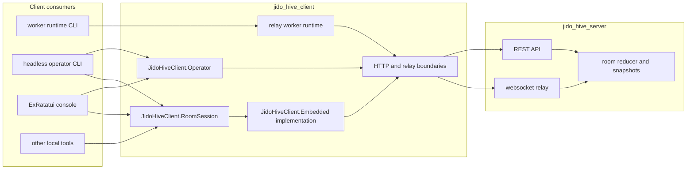

# JidoHiveClient

`jido_hive_client` is the reusable client/runtime platform for `jido_hive`.

It has three distinct roles:

- run long-lived worker participants against the relay
- provide a headless operator API and JSON CLI for scripts and debugging
- provide a room-scoped local session boundary for human-facing tools such as the ExRatatui console

It does not own room truth.
The server still does.

Start with the root [README](../README.md) if you want repo-wide context first.

## Table of contents

- [Quick start](#quick-start)
- [Architecture](#architecture)
- [Public surfaces](#public-surfaces)
- [Headless CLI](#headless-cli)
- [RoomSession library API](#roomsession-library-api)
- [Worker mode](#worker-mode)
- [Developer guide](#developer-guide)
- [Debugging order](#debugging-order)
- [Related docs](#related-docs)

## Quick start

### Build the headless CLI

```bash
cd jido_hive_client
mix deps.get
mix escript.build
```

### Inspect room state without the TUI

```bash
./jido_hive_client room list --api-base-url http://127.0.0.1:4000/api
./jido_hive_client room show --api-base-url http://127.0.0.1:4000/api --room-id <room-id>
./jido_hive_client room tail --api-base-url http://127.0.0.1:4000/api --room-id <room-id>
```

### Capture a structured debug trace

```bash
JIDO_HIVE_CLIENT_LOG_LEVEL=debug \
./jido_hive_client room show --api-base-url http://127.0.0.1:4000/api --room-id <room-id> \
  > room.json \
  2> trace.ndjson
```

### Submit human actions headlessly

```bash
./jido_hive_client room submit --api-base-url http://127.0.0.1:4000/api --room-id <room-id> --participant-id alice --text "hello"
./jido_hive_client room accept --api-base-url http://127.0.0.1:4000/api --room-id <room-id> --participant-id alice --context-id <context-id>
./jido_hive_client room resolve --api-base-url http://127.0.0.1:4000/api --room-id <room-id> --participant-id alice --left <ctx-a> --right <ctx-b> --text "resolution"
```

### Inspect connector auth state

```bash
./jido_hive_client auth state --api-base-url https://jido-hive-server-test.app.nsai.online/api --subject alice
```

### Worker mode

```bash
bin/client-worker --worker-index 1
bin/client-worker --worker-index 2
```

## Architecture



### Boundary rules

- `JidoHiveClient.Operator` owns server-facing operator workflows such as room inspection, publication planning, connector auth state, and room creation.
- `JidoHiveClient.RoomSession` owns room-scoped human participation semantics such as snapshot, refresh, submit-chat, and accept-context.
- `JidoHiveClient.Embedded` is the implementation behind `RoomSession`, not the surface new callers should reach for first.
- worker runtime code remains separate from operator/session flows.

## Public surfaces

### `JidoHiveClient.Operator`

Use this for headless operator actions that do not require a live room session.

Current responsibilities:

- config/bootstrap under `~/.config/hive`
- saved-room registry scoped by API base URL
- connector auth-state loading
- room fetch and timeline fetch
- target/policy listing
- room creation and run
- publication plan fetch and publish submit
- connector install start/complete
- direct contribution submission for scriptable conflict resolution

Representative functions:

- `ensure_initialized/0`
- `load_config/0`
- `list_saved_rooms/1`
- `fetch_room/2`
- `fetch_room_timeline/3`
- `create_room/2`
- `run_room/3`
- `fetch_publication_plan/2`
- `publish_room/3`
- `load_auth_state/2`
- `start_install/4`
- `complete_install/4`
- `submit_contribution/3`

### `JidoHiveClient.RoomSession`

Use this for room-scoped local participation.

Representative functions:

- `start_link/1`
- `snapshot/1`
- `refresh/1`
- `submit_chat/2`
- `accept_context/3`
- `shutdown/1`
- `sync_health/1`

### `JidoHiveClient.CLI`

This is the escript entrypoint. It supports both:

- worker runtime startup when invoked with worker/runtime flags
- headless operator/session commands when invoked with `room ...`, `auth ...`, `targets ...`, `policies ...`, `config show`, or `session ...`

## Headless CLI

### Room inspection

```bash
./jido_hive_client room list --api-base-url https://jido-hive-server-test.app.nsai.online/api
./jido_hive_client room show --api-base-url https://jido-hive-server-test.app.nsai.online/api --room-id <room-id>
./jido_hive_client room tail --api-base-url https://jido-hive-server-test.app.nsai.online/api --room-id <room-id>
```

### Room mutation

```bash
./jido_hive_client room create --api-base-url https://jido-hive-server-test.app.nsai.online/api --payload-file room.json
./jido_hive_client room run --api-base-url https://jido-hive-server-test.app.nsai.online/api --room-id <room-id> --max-assignments 1 --assignment-timeout-ms 60000 --request-timeout-ms 90000
./jido_hive_client room publish --api-base-url https://jido-hive-server-test.app.nsai.online/api --room-id <room-id> --payload-file publish.json
./jido_hive_client room submit --api-base-url https://jido-hive-server-test.app.nsai.online/api --room-id <room-id> --participant-id alice --text "hello"
./jido_hive_client room accept --api-base-url https://jido-hive-server-test.app.nsai.online/api --room-id <room-id> --participant-id alice --context-id <context-id>
./jido_hive_client room resolve --api-base-url https://jido-hive-server-test.app.nsai.online/api --room-id <room-id> --participant-id alice --left <ctx-a> --right <ctx-b> --text "resolution"
```

### Connector auth and install

Validated manual-install tokens:

- GitHub: `GITHUB_TOKEN`
- Notion: `NOTION_TOKEN`

Do not default to these unless revalidated:

- `GITHUB_OAUTH_ACCESS_TOKEN`
- `NOTION_OAUTH_ACCESS_TOKEN`

Typical production-safe flow:

```bash
./jido_hive_client auth install start --api-base-url https://jido-hive-server-test.app.nsai.online/api --channel github --subject alice
./jido_hive_client auth install complete --api-base-url https://jido-hive-server-test.app.nsai.online/api --install-id <install-id> --subject alice --access-token "$GITHUB_TOKEN"
./jido_hive_client auth install start --api-base-url https://jido-hive-server-test.app.nsai.online/api --channel notion --subject alice
./jido_hive_client auth install complete --api-base-url https://jido-hive-server-test.app.nsai.online/api --install-id <install-id> --subject alice --access-token "$NOTION_TOKEN"
```

```bash
./jido_hive_client auth state --api-base-url https://jido-hive-server-test.app.nsai.online/api --subject alice
./jido_hive_client auth install start --api-base-url https://jido-hive-server-test.app.nsai.online/api --channel github --subject alice --scope repo
./jido_hive_client auth install complete --api-base-url https://jido-hive-server-test.app.nsai.online/api --install-id <install-id> --subject alice --access-token "$GITHUB_TOKEN"
```

### Output contract

- read commands return JSON-ready room/auth/config data
- mutating commands return JSON with an explicit `operation_id`
- session snapshot/refresh commands return both `snapshot` and `sync_health`
- `JIDO_HIVE_CLIENT_LOG_LEVEL=debug` emits structured trace lines to stderr while JSON stays on stdout

This is the preferred way to reproduce or debug client behavior without involving the TUI.

## Live debugging and `iex`

### Fastest real-world order

1. inspect the server route directly
2. reproduce with `jido_hive_client` headlessly
3. only then open the TUI
4. only after the headless path is understood should you drop into `iex`

### Local client `iex`

```bash
cd jido_hive_client
iex -S mix
```

Useful examples:

```elixir
JidoHiveClient.Operator.fetch_room("https://jido-hive-server-test.app.nsai.online/api", "<room-id>")
JidoHiveClient.Operator.fetch_room_timeline("https://jido-hive-server-test.app.nsai.online/api", "<room-id>")

{:ok, session} =
  JidoHiveClient.RoomSession.start_link(
    room_id: "<room-id>",
    participant_id: "alice",
    participant_role: "coordinator",
    participant_kind: "human",
    api_base_url: "https://jido-hive-server-test.app.nsai.online/api"
  )

JidoHiveClient.RoomSession.snapshot(session)
JidoHiveClient.RoomSession.submit_chat(session, %{text: "debug probe", authority_level: "binding"})
```

### Production reality

- quick bash commands are the first-class production debugging path
- the repo does not yet have a supported production remote `iex --remsh` workflow
- use direct API calls, the headless client CLI, and Coolify/server logs instead

## RoomSession library API

### Start a session

```elixir
{:ok, session} =
  JidoHiveClient.RoomSession.start_link(
    room_id: "room-123",
    participant_id: "alice",
    participant_role: "coordinator",
    participant_kind: "human",
    api_base_url: "http://127.0.0.1:4000/api"
  )
```

### Submit chat

```elixir
{:ok, result} =
  JidoHiveClient.RoomSession.submit_chat(session, %{
    text: "This contradicts the selected context.",
    selected_context_id: "ctx-12",
    selected_context_object_type: "belief",
    selected_relation: "contradicts",
    authority_level: "binding",
    participant_id: "alice",
    participant_role: "coordinator"
  })
```

### Inspect sync health

```elixir
snapshot = JidoHiveClient.RoomSession.snapshot(session)
JidoHiveClient.RoomSession.sync_health(snapshot)
```

## Worker mode

Worker mode is still used by:

- `bin/client-worker`
- `bin/hive-clients`
- local and production worker smoke flows

Lifecycle:

1. start runtime
2. connect to Phoenix relay
3. identify participant and target
4. wait for `assignment.start`
5. execute locally
6. submit `contribution.submit`
7. wait for the next assignment

## Developer guide

### Code map

High-value client areas:

- `lib/jido_hive_client/operator.ex`: shared operator boundary
- `lib/jido_hive_client/room_session.ex`: room-scoped session surface
- `lib/jido_hive_client/embedded.ex`: session implementation details
- `lib/jido_hive_client/headless_cli.ex`: scriptable CLI dispatch layer
- `lib/jido_hive_client/cli.ex`: escript entrypoint and worker/headless dispatch
- `lib/jido_hive_client/boundary/`: HTTP and relay boundaries
- `lib/jido_hive_client/runtime/`: worker runtime

### Design rules

Keep the client narrow and explicit:

- do not move room truth into the client
- do not let the TUI become the only executable path for a room action
- prefer `Operator` for server workflows and `RoomSession` for local session workflows
- do not add console-local transport helpers back into the TUI app
- keep output JSON-ready for shell scripts and operator tooling

### Quality loop

From `jido_hive_client/`:

```bash
mix test
mix credo --strict
mix dialyzer --force-check
mix docs --warnings-as-errors
```

Or from the repo root:

```bash
mix ci
```

## Debugging order

When a bug is reported in the console:

1. reproduce through the headless CLI first
2. if it reproduces there, debug `Operator`, `RoomSession`, or server behavior
3. if it does not, debug the ExRatatui console
4. if the client surface is missing the needed headless action, add it before changing more UI code
5. if you need deeper local introspection, use local `iex`; do not jump straight to production remote-shell assumptions

## Related docs

- Root guide: [README.md](../README.md)
- Server guide: [jido_hive_server/README.md](../jido_hive_server/README.md)
- Console guide: [examples/jido_hive_termui_console/README.md](../examples/jido_hive_termui_console/README.md)
- Debugging runbook: `~/jb/docs/20260408/jido_hive_debugging_introspection/jido_hive_debugging_introspection_and_runbook.md`
