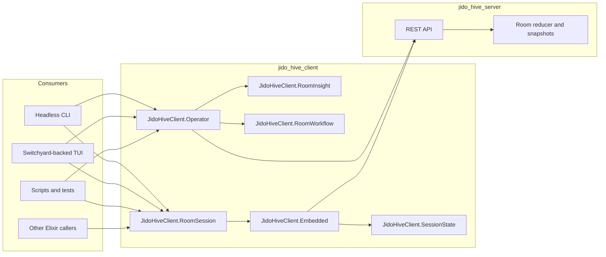

# Jido Hive Client

`jido_hive_client` is the reusable operator and room-session package for
`jido_hive`.

It does not own worker execution anymore.

Use this package when you need:

- headless operator inspection and mutation against `jido_hive_server`
- a room-scoped local session boundary for human participation
- a reproducible JSON CLI for scripts, smoke checks, and bug isolation
- the reusable transport/session seam beneath `jido_hive_surface`, the
  Switchyard TUI, and the Phoenix web UI

Do not use this package for relay workers or assignment execution. That lives in
[../jido_hive_worker_runtime/README.md](../jido_hive_worker_runtime/README.md).

If you are building a new UI package, prefer
[../jido_hive_surface/README.md](../jido_hive_surface/README.md) as the first
application-facing entrypoint, and use `jido_hive_client` directly only for the
lower-level operator/session boundary.

Start with the workspace [README](../README.md) if you need repo-wide context.

## Quick start

### Build the headless CLI

```bash
cd jido_hive_client
mix deps.get
mix escript.build
```

### Inspect room state without the TUI

```bash
./jido_hive_client room list --api-base-url http://127.0.0.1:4000/api
./jido_hive_client room show --api-base-url http://127.0.0.1:4000/api --room-id <room-id>
./jido_hive_client room workflow --api-base-url http://127.0.0.1:4000/api --room-id <room-id>
./jido_hive_client room focus --api-base-url http://127.0.0.1:4000/api --room-id <room-id>
./jido_hive_client room inspect --api-base-url http://127.0.0.1:4000/api --room-id <room-id>
./jido_hive_client room provenance --api-base-url http://127.0.0.1:4000/api --room-id <room-id> --context-id <context-id>
./jido_hive_client room tail --api-base-url http://127.0.0.1:4000/api --room-id <room-id>
./jido_hive_client room publish-plan --api-base-url http://127.0.0.1:4000/api --room-id <room-id>
```

### Submit human actions headlessly

```bash
./jido_hive_client room submit --api-base-url http://127.0.0.1:4000/api --room-id <room-id> --participant-id alice --text "hello"
./jido_hive_client room accept --api-base-url http://127.0.0.1:4000/api --room-id <room-id> --participant-id alice --context-id <context-id>
./jido_hive_client room resolve --api-base-url http://127.0.0.1:4000/api --room-id <room-id> --participant-id alice --left <ctx-a> --right <ctx-b> --text "resolution"
```

### Capture a structured trace

```bash
JIDO_HIVE_CLIENT_LOG_LEVEL=debug \
./jido_hive_client room show --api-base-url http://127.0.0.1:4000/api --room-id <room-id> \
  > room.json \
  2> trace.ndjson
```

Rules:

- JSON stays on stdout
- trace stays on stderr
- use this before adding ad hoc logging

### Use the RoomSession library boundary

```elixir
{:ok, session} =
  JidoHiveClient.RoomSession.start_link(
    room_id: "room-1",
    api_base_url: "http://127.0.0.1:4000/api",
    participant_id: "alice",
    participant_role: "coordinator"
  )

{:ok, snapshot} = JidoHiveClient.RoomSession.refresh(session)
{:ok, _result} = JidoHiveClient.RoomSession.submit_chat(session, %{text: "debug probe"})
JidoHiveClient.RoomSession.shutdown(session)
```

## Architecture



### Boundary rules

- `JidoHiveClient.Operator` owns server-facing operator workflows
- `JidoHiveClient.RoomSession` owns room-scoped local participation behavior
- the embedded room-session implementation is private behind `RoomSession`
- client-local session state and event history are private bookkeeping, not
  worker runtime state
- worker execution, relay registration, and local assignment execution are out of
  scope for this package

## Public surfaces

### `JidoHiveClient.Operator`

Use this for headless operator actions that do not require a live room session.

Current responsibilities:

- config/bootstrap under `~/.config/hive`
- saved-room registry scoped by API base URL
- connector auth-state loading
- room fetch, workflow inspection, and timeline fetch
- target and policy listing
- room creation and run-operation control
- publication plan fetch and publish submit
- connector install start and complete
- direct contribution submission for scriptable conflict resolution

Representative functions:

- `ensure_initialized/0`
- `load_config/0`
- `list_saved_rooms/1`
- `fetch_room/2`
- `fetch_room_sync/3`
- `fetch_room_timeline/3`
- `create_room/2`
- `start_room_run_operation/3`
- `fetch_room_run_operation/4`
- `fetch_publication_plan/2`
- `publish_room/3`
- `load_auth_state/2`
- `submit_contribution/4`

### `JidoHiveClient.RoomInsight`

Use this when you need reusable operator-facing derivations from room truth.

Current responsibilities:

- control-plane digest from the server workflow contract
- focus queue normalization
- provenance tracing for a selected context object
- recommended operator actions for a selected object

### `JidoHiveClient.RoomSession`

Use this for room-scoped local participation.

Representative functions:

- `start_link/1`
- `snapshot/1`
- `refresh/1`
- `submit_chat/2`
- `submit_chat_async/2`
- `accept_context/3`
- `shutdown/1`
- `sync_health/1`

Snapshot shape now includes:

- `participant`
- `session_state`
- `timeline`
- `context_objects`
- `operations`
- `transport`

The old worker-style `runtime` field is gone from this surface.

### `JidoHiveClient.Scenario.RoomWorkflow`

Use this when you want an executable create/submit/run/wait/sync regression
without the TUI.

## Headless CLI

The escript entrypoint is operator/session only.

Representative command groups:

- `config show`
- `room list`
- `room show`
- `room workflow`
- `room focus`
- `room inspect`
- `room provenance`
- `room tail`
- `room create`
- `room run`
- `room run-status`
- `room publish-plan`
- `room publish`
- `room submit`
- `room accept`
- `room resolve`
- `auth state`
- `targets list`
- `policies list`

## What is not in this package

Notably absent now:

- relay websocket workers
- assignment execution
- prompt shaping for worker turns
- result decoding for worker contributions
- worker control endpoints
- subprocess/runtime bootstrap

Those live in
[../jido_hive_worker_runtime/README.md](../jido_hive_worker_runtime/README.md).

## Developer workflow

Run package-local checks from this directory:

```bash
mix format --check-formatted
mix compile --warnings-as-errors
mix test
mix credo --strict
mix dialyzer
mix docs --warnings-as-errors
```

For repo-wide checks:

```bash
cd ..
mix ci
```

## Debugging order

Always debug in this order:

1. server truth
2. this package
3. worker runtime only if the bug is assignment delivery or execution
4. the Switchyard-backed TUI

Representative sequence:

```bash
setup/hive server-info
curl -sS http://127.0.0.1:4000/api/rooms/<room-id> | jq

cd jido_hive_client
mix escript.build
./jido_hive_client room show --api-base-url http://127.0.0.1:4000/api --room-id <room-id>
./jido_hive_client room submit --api-base-url http://127.0.0.1:4000/api --room-id <room-id> --participant-id alice --text "debug probe"
```

If it reproduces there, it is not a TUI-only bug.

For the full triage order, read
[../docs/debugging_guide.md](../docs/debugging_guide.md).

## Code map

- `lib/jido_hive_client/operator.ex`
  headless operator surface
- `lib/jido_hive_client/headless_cli.ex`
  JSON CLI dispatch
- `lib/jido_hive_client/room_session.ex`
  public room-session surface
- `lib/jido_hive_client/embedded.ex`
  room-session implementation
- `lib/jido_hive_client/session_state.ex`
  client-local session bookkeeping
- `lib/jido_hive_client/session_event_log.ex`
  client-local session event history
- `lib/jido_hive_client/room_workflow.ex`
  workflow summary normalization
- `lib/jido_hive_client/room_insight.ex`
  focus queue and provenance derivation

## Related docs

- [Workspace README](../README.md)
- [Jido Hive Worker Runtime README](../jido_hive_worker_runtime/README.md)
- [Jido Hive Server README](../jido_hive_server/README.md)
- [Jido Hive Console README](../examples/jido_hive_console/README.md)
- [Debugging Guide](../docs/debugging_guide.md)
