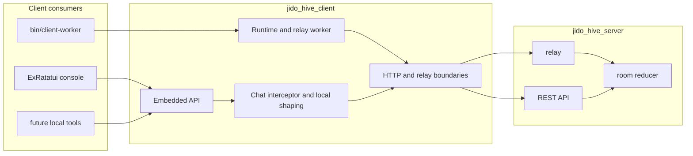

# JidoHiveClient

`jido_hive_client` is the participant runtime for `jido_hive`.

It has two jobs:

- run long-lived workers against the server relay
- provide an embedded Elixir API for local human-facing tools

It does not own room truth. The server still does.

Start with the root [README](/home/home/p/g/n/jido_hive/README.md) if you want
repo-wide context.

## Table of contents

- [Quick start](#quick-start)
- [Runtime architecture](#runtime-architecture)
- [Worker mode](#worker-mode)
- [Embedded mode](#embedded-mode)
- [Public API surface](#public-api-surface)
- [Developer guide](#developer-guide)
- [Related docs](#related-docs)

## Quick start

### Worker mode

```bash
bin/client-worker --worker-index 1
bin/client-worker --worker-index 2
```

### Embedded mode

```elixir
{:ok, embedded} =
  JidoHiveClient.Embedded.start_link(
    room_id: "room-123",
    participant_id: "alice",
    participant_role: "collaborator",
    api_base_url: "http://127.0.0.1:4000/api"
  )

:ok = JidoHiveClient.Embedded.subscribe(embedded)
{:ok, _} = JidoHiveClient.Embedded.snapshot(embedded)
```

## Runtime architecture



### Boundary rule

- client executes
- server decides

That boundary is what lets the same room support both worker runtimes and local
human tools without splitting authority.

## Worker mode

Worker mode is used by:

- `bin/client-worker`
- `bin/hive-clients`
- local and production worker smoke flows

Lifecycle:

1. start runtime
2. connect to Phoenix relay
3. identify participant and target
4. wait for `assignment.start`
5. execute locally
6. submit `contribution.submit`
7. wait for the next assignment

## Embedded mode

Embedded mode is used by the console and any local Elixir tool that wants
participant behavior without running a separate daemon.

Current embedded responsibilities:

- maintain a local room snapshot
- subscribe to room updates
- poll timeline and context surfaces
- accept human chat input
- shape that input into structured contributions
- submit those contributions back to the server

### Embedded action semantics

The embedded path is intentionally narrow:

- submission success means the contribution was accepted by the server boundary
- follow-up room sync happens after that acceptance and may complete later
- local refresh failure must not be treated as proof that the server rejected the contribution
- room truth is always re-read from the server instead of being finalized locally

### Current human authoring contract

The embedded path supports:

- `selected_context_id`
- `selected_context_object_type`
- `selected_relation`
- `authority_level`

Supported relation modes:

- `contextual`
- `references`
- `derives_from`
- `supports`
- `contradicts`
- `resolves`
- `none`

## Public API surface

Primary embedded entry points:

- `JidoHiveClient.Embedded.start_link/1`
- `JidoHiveClient.Embedded.snapshot/1`
- `JidoHiveClient.Embedded.subscribe/1`
- `JidoHiveClient.Embedded.submit_chat/2`
- `JidoHiveClient.Embedded.accept_context/3`
- `JidoHiveClient.Embedded.refresh/1`
- `JidoHiveClient.Embedded.shutdown/1`

Typical embedded submit:

```elixir
{:ok, _contribution} =
  JidoHiveClient.Embedded.submit_chat(embedded, %{
    text: "I think this claim contradicts the selected context.",
    selected_context_id: "ctx-12",
    selected_relation: "contradicts",
    authority_level: "binding"
  })
```

## Developer guide

### Code map

High-value areas:

- boundary adapters and transport: `lib/jido_hive_client/boundary/`
- worker runtime: `lib/jido_hive_client/runtime/`
- embedded API: `lib/jido_hive_client/embedded/`
- chat shaping and interception: `lib/jido_hive_client/interceptor/`

### Design constraints

Keep the client narrow:

- do not move room truth into the client
- do not duplicate server-side context-manager decisions locally
- do not let the embedded path invent new room semantics
- do keep the embedded API ergonomic for local tools

### Architecture discussion

The client exists to make the server usable, not to compete with it:

- worker mode optimizes execution against the relay contract
- embedded mode optimizes human participation against the REST room surface
- both modes should converge on the same room semantics and contribution contract

### Local quality loop

From `jido_hive_client/`:

```bash
mix test
mix credo --strict
mix dialyzer --force-check
mix docs --warnings-as-errors
```

Or from the repo root:

```bash
mix ci
```

## Related docs

- Root guide: [README.md](/home/home/p/g/n/jido_hive/README.md)
- Server guide: [jido_hive_server/README.md](/home/home/p/g/n/jido_hive/jido_hive_server/README.md)
- Console guide: [examples/jido_hive_termui_console/README.md](/home/home/p/g/n/jido_hive/examples/jido_hive_termui_console/README.md)
