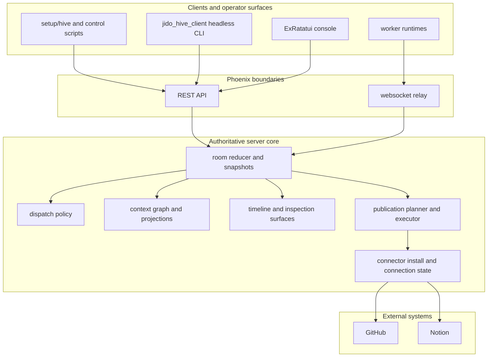

# JidoHiveServer

`jido_hive_server` is the authoritative room server for `jido_hive`.

If one rule should survive every refactor, it is this:

- the server owns room truth

Workers may execute elsewhere.
The headless client may reproduce operator flows without the TUI.
The ExRatatui console may render those flows interactively.
None of those surfaces define canonical room state.
The server does.

## Table of contents

- [Quick start](#quick-start)
- [Architecture](#architecture)
- [Core responsibilities](#core-responsibilities)
- [Transport surfaces](#transport-surfaces)
- [Connector install and publication flow](#connector-install-and-publication-flow)
- [Developer guide](#developer-guide)
- [Deployment](#deployment)
- [Related docs](#related-docs)

## Quick start

Run the server locally:

```bash
bin/live-demo-server
```

Useful local checks:

```bash
setup/hive doctor
setup/hive server-info
setup/hive targets
```

Useful production checks:

```bash
setup/hive --prod doctor
setup/hive --prod server-info
setup/hive --prod targets
```

Local `iex` server debug:

```bash
cd jido_hive_server
iex -S mix phx.server
```

## Architecture



### Practical model

- `POST /rooms/:id/contributions` and `POST /rooms/:id/publications` are server-owned truth mutations.
- the client may shape or submit intent, but the server decides what lands.
- if a TUI bug and a headless client bug disagree, the server response is still the ground truth.

## Core responsibilities

The server is responsible for:

- room lifecycle and persistence
- participant registration and target discovery
- assignment dispatch
- contribution validation and reduction
- context graph projection
- contradiction/staleness/relationship signals
- publication planning and execution
- connector install and connection state

It is not responsible for being a terminal UI toolkit, a shell runner, or a second client runtime.

## Transport surfaces

### REST

Mounted under `/api`.

High-value routes include:

- `GET /rooms/:id`
- `GET /rooms/:id/timeline`
- `POST /rooms`
- `POST /rooms/:id/run_operations`
- `GET /rooms/:id/run_operations/:operation_id`
- `POST /rooms/:id/contributions`
- `GET /rooms/:id/publication_plan`
- `POST /rooms/:id/publications`
- `GET /targets`
- `GET /policies`
- `POST /connectors/:connector_id/installs`
- `POST /connectors/installs/:install_id/complete`
- `GET /connectors/:connector_id/connections`

### Websocket relay

Worker runtimes connect through Phoenix Channels to receive assignments and submit structured work.

## Connector install and publication flow

This area is the most common source of production operator confusion.

### Scope inference behavior

Manual installs no longer require explicit `--scope` flags to remain usable.

Current server behavior:

- `start_install` infers connector-defined requested scopes when omitted
- `complete_install` infers granted scopes from the install when omitted

That prevents the old failure mode where a connection appeared connected but execution was denied because the scope set was empty.

### Validated manual-install token types

Use these exact token types for current production manual installs:

- GitHub: `GITHUB_TOKEN`
- Notion: `NOTION_TOKEN`

Do not treat these as the default manual-install path unless revalidated:

- `GITHUB_OAUTH_ACCESS_TOKEN`
- `NOTION_OAUTH_ACCESS_TOKEN`

Observed live behavior on 2026-04-08:

- PAT-backed GitHub token worked for issue creation in `nshkrdotcom/test`
- GitHub OAuth access token connected previously but failed issue creation
- Notion internal integration token worked for page creation
- Notion OAuth access token was rejected by the provider

### Current validated targets

- GitHub repo: `nshkrdotcom/test`
- Notion data source: `49970410-3e2c-49c9-bd4d-220ebb5d72f7`

### Step-by-step production connector recipe

1. GitHub:
   - create a classic PAT with `repo` scope
   - export it as `GITHUB_TOKEN`
   - do not use `GITHUB_OAUTH_ACCESS_TOKEN` as the default manual-install token
2. Notion:
   - create an internal integration
   - share the target data source with that integration
   - export the token as `NOTION_TOKEN`
   - do not use `NOTION_OAUTH_ACCESS_TOKEN` as the default manual-install token
3. Reload your shell:
   - `source ~/.bash/bash_secrets`
4. Start and complete the server-backed installs:
   - `setup/hive --prod start-install github --subject alice`
   - `setup/hive --prod complete-install <install-id> --subject alice --access-token "$GITHUB_TOKEN"`
   - `setup/hive --prod start-install notion --subject alice`
   - `setup/hive --prod complete-install <install-id> --subject alice --access-token "$NOTION_TOKEN"`
5. Verify both connections:
   - `setup/hive --prod connections github --subject alice`
   - `setup/hive --prod connections notion --subject alice`
6. Verify publish through either:
   - the headless client CLI, or
   - the ExRatatui console publish screen

For the full site-by-site operator walkthrough, use:

- [examples/jido_hive_termui_console/README.md](../examples/jido_hive_termui_console/README.md)

## Developer guide

### Code map

High-value server areas:

- `lib/jido_hive_server/collaboration/`: rooms, reducers, dispatch, projections
- `lib/jido_hive_server/publications/`: publication planning and execution
- `lib/jido_hive_server_web/controllers/`: REST boundary
- `lib/jido_hive_server/integrations_bootstrap.ex`: connector registration

### Design rules

When changing the server:

- keep room truth centralized
- keep derived context signals deterministic
- reject malformed relation writes at append time
- keep publication auth and execution explicit
- do not move connector policy decisions into the client or console

### Debugging order

1. Confirm the server route returns the expected truth.
2. Reproduce through `jido_hive_client` headless CLI.
3. Only after that, inspect the ExRatatui console.
4. Use local `iex` when reducer/controller internals matter.
5. Production remote `iex` is not yet a supported repo workflow; use Coolify logs, direct HTTP, and the headless client first.

If a bug appears only in the TUI, it is not a server bug.
If the server route is wrong, the client and TUI should not compensate for it.

Detailed runbook:

- `~/jb/docs/20260408/jido_hive_debugging_introspection/jido_hive_debugging_introspection_and_runbook.md`

General reproducible workflow:

- `docs/debugging_guide.md`

### Quality loop

From `jido_hive_server/`:

```bash
mix test
mix credo --strict
mix dialyzer --force-check
mix docs --warnings-as-errors
```

Or from the repo root:

```bash
mix ci
```

## Deployment

Coolify tasks run from the server app with `MIX_ENV=coolify`:

```bash
scripts/deploy_coolify.sh
cd jido_hive_server
MIX_ENV=coolify mix coolify.latest --project server
MIX_ENV=coolify mix coolify.status --project server --latest
```

## Related docs

- Root guide: [README.md](../README.md)
- General debugging guide: `docs/debugging_guide.md`
- Client guide: [jido_hive_client/README.md](../jido_hive_client/README.md)
- Console guide: [examples/jido_hive_termui_console/README.md](../examples/jido_hive_termui_console/README.md)
