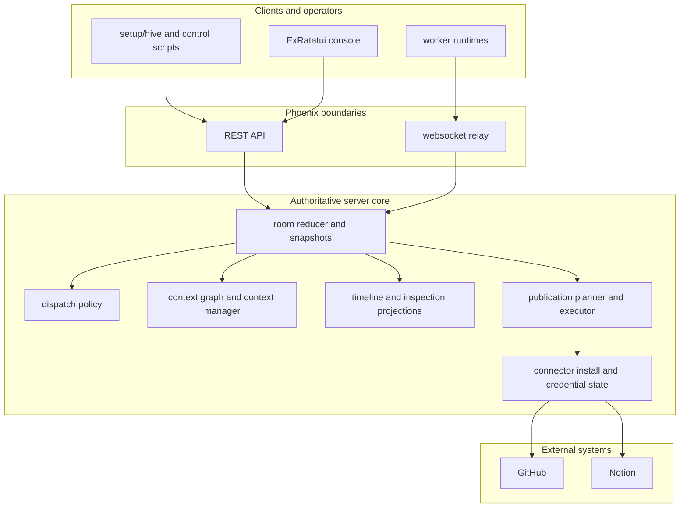

# JidoHiveServer

`jido_hive_server` is the authoritative room server for `jido_hive`.

If one rule should survive every refactor, it is this:

- the server owns room truth

Workers may execute elsewhere. Consoles may render the room in different ways.
Connectors may publish out to GitHub and Notion. None of those surfaces define
canonical room state. The server does.

## Table of contents

- [Quick start](#quick-start)
- [Server architecture](#server-architecture)
- [Core responsibilities](#core-responsibilities)
- [Transport surfaces](#transport-surfaces)
- [Connector install and publication flow](#connector-install-and-publication-flow)
- [Developer guide](#developer-guide)
- [Deployment](#deployment)
- [Related docs](#related-docs)

## Quick start

Run the server locally:

```bash
bin/live-demo-server
```

Useful local checks:

```bash
setup/hive doctor
setup/hive server-info
setup/hive targets
```

Useful production checks:

```bash
setup/hive --prod doctor
setup/hive --prod server-info
setup/hive --prod targets
```

## Server architecture



## Core responsibilities

The server is responsible for:

- room lifecycle and persistence
- participant registration and target discovery
- assignment dispatch
- contribution validation and reduction
- context graph projection
- context-manager decisions such as contradiction and stale derivation signals
- publication planning and execution
- connector install and connection state

It is not responsible for being a generic shell runner or a graph database.

## Transport surfaces

### REST

Mounted under `/api`.

Important routes include:

- `GET /rooms/:id`
- `GET /rooms/:id/events`
- `GET /rooms/:id/context_objects`
- `POST /rooms/:id/contributions`
- `POST /rooms/:id/run`
- `GET /rooms/:id/publication_plan`
- `POST /rooms/:id/publications`
- `POST /connectors/:connector_id/installs`
- `POST /connectors/installs/:install_id/complete`
- `GET /connectors/:connector_id/connections`

### Websocket relay

Worker runtimes connect through Phoenix Channels to receive assignments and
submit structured work.

## Connector install and publication flow

This area matters for real operator success.

### Scope inference behavior

Manual installs no longer require explicit `--scope` flags to stay usable.

The current server behavior is:

- `start_install` infers connector-authored requested scopes when omitted
- `complete_install` infers granted scopes from the install when omitted

That change fixed the production failure mode where a connection looked
connected but policy correctly denied execution because the scope set was empty.

### Recommended manual-install credentials

For current production operator flows:

- GitHub: use a PAT-backed `GITHUB_TOKEN`
- Notion: use an internal integration `NOTION_TOKEN`

Do not assume these are the right default manual tokens without revalidation:

- `GITHUB_OAUTH_ACCESS_TOKEN`
- `NOTION_OAUTH_ACCESS_TOKEN`

Observed live behavior on 2026-04-08:

- PAT-backed GitHub token worked for issue creation in `nshkrdotcom/test`
- GitHub OAuth access token connected but failed issue creation
- Notion internal integration token worked for page creation
- Notion OAuth access token was rejected by the provider

### Operator verification commands

```bash
setup/hive --prod connections github --subject alice
setup/hive --prod connections notion --subject alice
```

### Step-by-step production connector recipe

This is the shortest reliable operator path on the current production stack.

1. GitHub:
   - create a classic PAT with `repo` scope
   - store it as `GITHUB_TOKEN`
   - do not use `GITHUB_OAUTH_ACCESS_TOKEN` as the default manual-install token
2. Notion:
   - create an internal integration
   - share the target data source with that integration
   - store the token as `NOTION_TOKEN`
   - do not use `NOTION_OAUTH_ACCESS_TOKEN` as the default manual-install token
3. Export the working values in `~/.bash/bash_secrets`.
4. Reload your shell with `source ~/.bash/bash_secrets`.
5. Complete the server-backed installs:
   - `setup/hive --prod start-install github --subject alice`
   - `setup/hive --prod complete-install <install-id> --subject alice --access-token "$GITHUB_TOKEN"`
   - `setup/hive --prod start-install notion --subject alice`
   - `setup/hive --prod complete-install <install-id> --subject alice --access-token "$NOTION_TOKEN"`
6. Verify both connections:
   - `setup/hive --prod connections github --subject alice`
   - `setup/hive --prod connections notion --subject alice`

Current validated publish targets:

- GitHub repo: `nshkrdotcom/test`
- Notion data source: `49970410-3e2c-49c9-bd4d-220ebb5d72f7`

If you need the full site-by-site credential walkthrough, use the console guide:

- [examples/jido_hive_termui_console/README.md](/home/home/p/g/n/jido_hive/examples/jido_hive_termui_console/README.md)

## Developer guide

### Code map

High-value server areas:

- `lib/jido_hive_server/collaboration/`: rooms, reducers, projections, policies
- `lib/jido_hive_server/publications/`: publication planning and execution
- `lib/jido_hive_server_web/controllers/`: REST boundary
- `lib/jido_hive_server/integrations_bootstrap.ex`: connector registration

### Design rules

When changing the server:

- keep room truth centralized
- keep derived context signals deterministic
- reject malformed relation writes at append time
- keep publication auth and execution explicit
- do not move connector policy decisions into the client or console

### Architecture discussion

Two server design choices matter more than the rest:

- room snapshots are the product surface; every other projection is downstream of them
- connector installs are not just credentials, they are policy-bearing server records that must survive across operator sessions

### Local quality loop

From `jido_hive_server/`:

```bash
mix test
mix credo --strict
mix dialyzer --force-check
mix docs --warnings-as-errors
```

Or from the repo root:

```bash
mix ci
```

## Deployment

Coolify tasks run from the server app with `MIX_ENV=coolify`:

```bash
scripts/deploy_coolify.sh
cd jido_hive_server
MIX_ENV=coolify mix coolify.latest --project server
MIX_ENV=coolify mix coolify.status --project server --latest
```

## Related docs

- Root guide: [README.md](/home/home/p/g/n/jido_hive/README.md)
- Client guide: [jido_hive_client/README.md](/home/home/p/g/n/jido_hive/jido_hive_client/README.md)
- Console guide: [examples/jido_hive_termui_console/README.md](/home/home/p/g/n/jido_hive/examples/jido_hive_termui_console/README.md)
