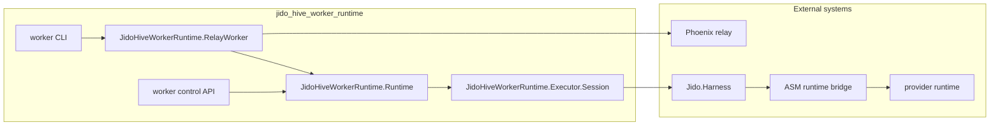

# Jido Hive Worker Runtime

`jido_hive_worker_runtime` is the relay worker and assignment-execution package
for `jido_hive`.

Use this package when you need:

- long-lived websocket relay workers
- local assignment execution through the configured runtime stack
- worker control endpoints for local supervision and testing
- a worker-focused escript and CLI entrypoint

Do not use this package for headless operator workflows or room-scoped human
session behavior. That lives in
[../jido_hive_client/README.md](../jido_hive_client/README.md).

Start with the workspace [README](../README.md) if you need repo-wide context.

## Quick start

### Preferred repo-root launch path

From the workspace root:

```bash
bin/client-worker --worker-index 1
bin/client-worker --worker-index 2
```

Those scripts launch this package with the right relay defaults.

### Build and run the worker escript directly

```bash
cd jido_hive_worker_runtime
mix deps.get
mix escript.build

./jido_hive_worker \
  --url ws://127.0.0.1:4000/socket/websocket \
  --relay-topic relay:workspace-local \
  --workspace-id workspace-local \
  --participant-id worker-01 \
  --participant-role worker \
  --target-id target-worker-01 \
  --user-id user-worker-01 \
  --capability-id workspace.exec.session
```

### Run with the local demo server

```bash
bin/live-demo-server
bin/client-worker --worker-index 1
bin/client-worker --worker-index 2
```

## Architecture



### Boundary rules

- the relay worker owns websocket relay participation
- the worker runtime state store owns local assignment and event state
- `JidoHiveWorkerRuntime.Executor.*` owns prompt shaping, model/session
  execution, repair, and result normalization
- `JidoHiveWorkerRuntime.Control.*` owns the worker-local control API
- this package does not own operator inspection workflows or room-scoped human
  session state

## Public surfaces

### Worker CLI

Responsibilities:

- normalize worker runtime CLI options
- bootstrap `tzdata` and `erlexec` for escripts
- configure worker runtime and optional control API app env
- start the worker supervision tree and relay worker

### Relay worker

The long-lived websocket client that:

- joins the relay
- registers the worker target
- receives `assignment.start`
- invokes the local runtime
- publishes normalized contributions back to the server

### Runtime state

Worker-local assignment state and event history.

Responsibilities:

- connection status
- recent assignment history
- assignment failure tracking
- event stream for the control API

### Session executor

The default executor path for structured worker turns.

Responsibilities:

- prompt shaping
- session start
- streaming execution
- repair pass on invalid contribution JSON
- normalized contribution output

## Local control API

The package can optionally expose a local worker control API when
`--control-port` is provided.

That surface is intended for:

- local supervision
- runtime smoke checks
- package tests

It is not the operator-facing headless API. That belongs to
`jido_hive_client`.

## Developer workflow

Run package-local checks from this directory:

```bash
mix format --check-formatted
mix compile --warnings-as-errors
mix test
mix credo --strict
mix dialyzer
mix docs --warnings-as-errors
```

For repo-wide checks:

```bash
cd ..
mix ci
```

## Debugging order

When a worker path looks wrong, debug in this order:

1. `jido_hive_server` room and relay truth
2. this package
3. the operator client or TUI only if the bug is how results are shown

Useful checks:

```bash
setup/hive targets
curl -sS http://127.0.0.1:4000/api/targets | jq
bin/client-worker --worker-index 1
```

If the target never registers or assignments never arrive, stay in the worker
runtime and server layers.

## Code map

- `lib/jido_hive_worker_runtime/cli.ex`
  worker CLI and app bootstrap
- `lib/jido_hive_worker_runtime/relay_worker.ex`
  websocket relay worker
- `lib/jido_hive_worker_runtime/runtime.ex`
  worker-local runtime state and event stream
- `lib/jido_hive_worker_runtime/executor/session.ex`
  main execution path
- `lib/jido_hive_worker_runtime/control/router.ex`
  worker control API
- `lib/jido_hive_worker_runtime/escript_bootstrap.ex`
  `tzdata` and `erlexec` staging for escripts

## Related docs

- [Workspace README](../README.md)
- [Jido Hive Client README](../jido_hive_client/README.md)
- [Jido Hive Server README](../jido_hive_server/README.md)
- [Debugging Guide](../docs/debugging_guide.md)
